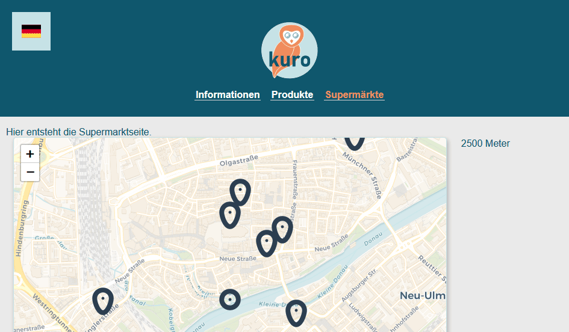

# kuro-web

Web Frontend Entwicklung für Projekt Kuro, entwickelt mit `Vue.js.`

## Aktueller Stand von `kuro-web`

Folgende Screenshots zeigen den aktuellsten Stand (Stand: 14.04.2020) von `kuro-web`.

#### Produkte Seite


#### Supermärkte Seite


*Ansicht von `kuro` bei Benutzung des Web-Clients.*

## Project setup

```console
yarn install
```

### Compiles and hot-reloads for development

```console
yarn run serve
```

### Compiles and minifies for production

```console
yarn run build
```

### Run your tests

```console
yarn run test
```

### Lints and fixes files

```console
yarn run lint
```

### Customize configuration

See [Configuration Reference](https://cli.vuejs.org/config/).
